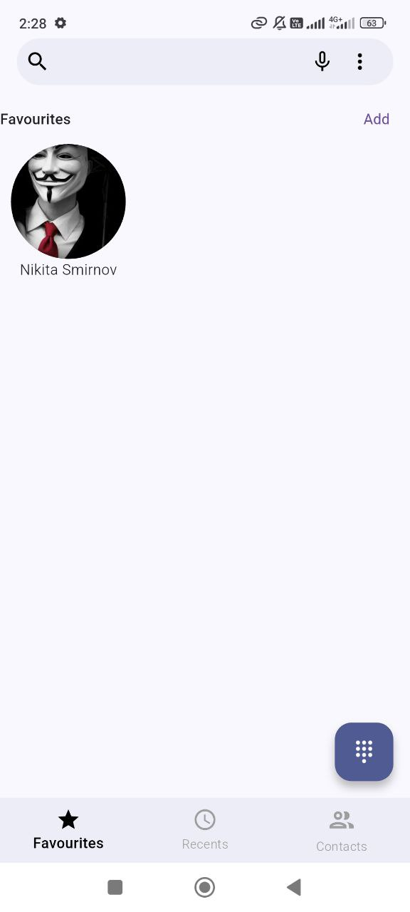
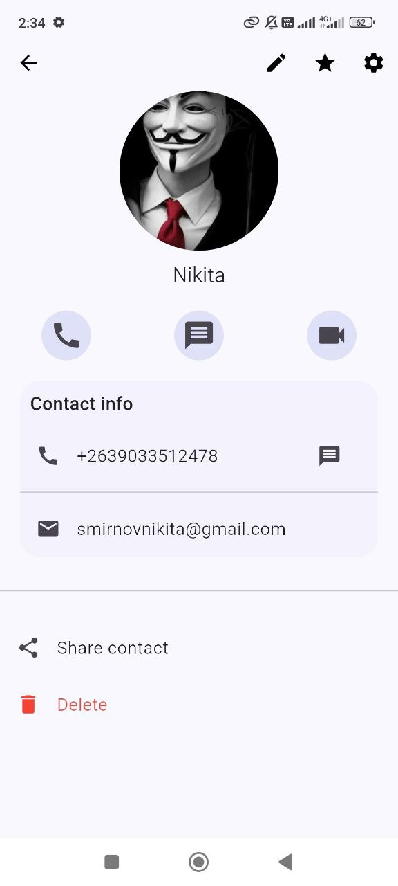
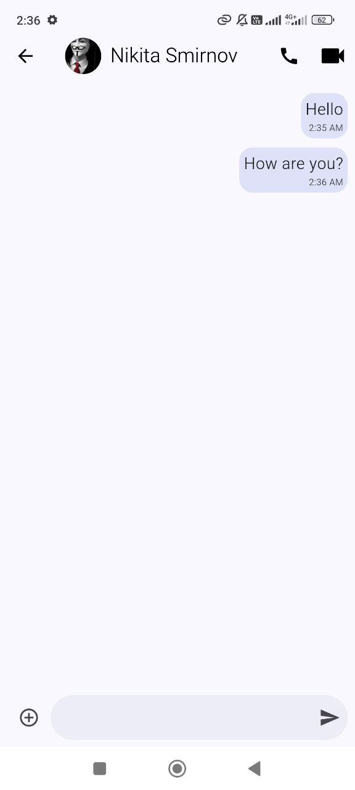

# Phone

This is a mobile application for SMS and call management. The app includes voice recognition functionality, uses Shared Preferences for storing settings, and ObjectBox for storing favorite contacts. The architecture of the app follows MVVM (Model-View-ViewModel) with Provider for state management.

## Features
- SMS writing and sending: Compose and send SMS directly from the app.
- Voice recognition: Use voice commands to interact with the app.
- Favorite contacts: Store and access your favorite contacts using ObjectBox for fast local storage.
- Settings management: Save user preferences using SharedPreferences.
- MVVM + Provider: The app follows the MVVM architecture pattern for better separation of concerns and maintainability.

## Installation

1. Clone this repository to your local machine:
   git clone https://github.com/your-username/sms-and-call-app.git
2. Get token from https://console.deepgram.com/ and paste into assets/api.env